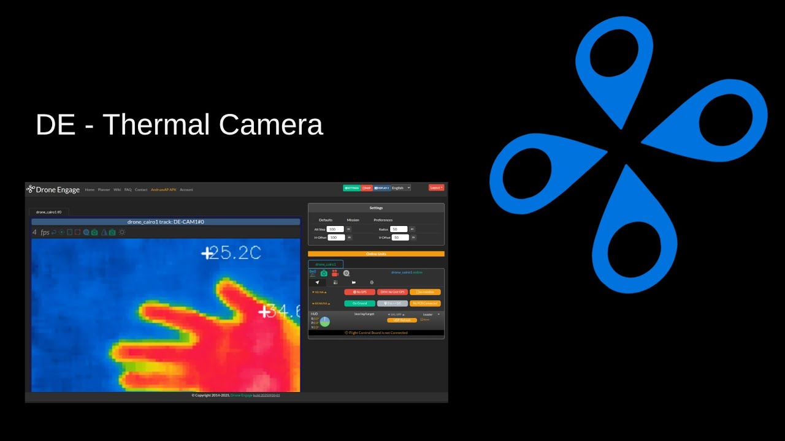

# DroneEngage IR Camera Module

[](https://www.youtube.com/watch?v=dI4fy4F1EEQ)

## Overview

The **DroneEngage IR Camera Module** (`de_ir_camera`) is a C++ module that provides thermal imaging detection and RGB+IR fusion for the DroneEngage ecosystem. It reads thermal data from an MI48 thermal sensor, detects the hottest and coldest points in each frame, optionally fuses the thermal image with an RGB camera feed, and publishes hot/cold point locations to the DroneEngage communication bus.

This module performs **detection and fusion**, not object tracking. It reports the hottest and coldest point locations every frame (with EMA smoothing). Object tracking is handled by the separate [`drone_engage_tracking`](https://github.com/DroneEngage/droneengage_tracking) module.

---

## Virtual Video Device Chain — How Modules Connect

> **This is a core architectural concept in DroneEngage.** Modules do not exchange video frames directly with each other. Instead, each module reads from an input video device, processes the frame, and writes the result to an **output virtual video device** (created via `v4l2loopback`). The next module in the chain reads from that virtual device as its input, and so on. This creates a **pipeline of virtual video devices** that allows modules to be chained together flexibly.

### How It Works

```
Physical Cameras          Module 1                Module 2                Module 3
┌─────────────┐     ┌──────────────────┐     ┌──────────────────┐     ┌──────────────────┐
│ MI48 IR     │────▶│ de_ir_camera     │────▶│ de_tracker       │────▶│ de_ai / GCS      │
│ (serial)    │     │                  │     │                  │     │                  │
│ RGB Camera  │────▶│ reads IR + RGB   │     │ reads fused      │     │ reads tracked    │
│ (/dev/video)│     │ fuses them       │     │ video, tracks    │     │ video, detects   │
└─────────────┘     │ writes to DE-TRK │     │ writes to DE-CAM │     │ ...              │
                    └──────────────────┘     └──────────────────┘     └──────────────────┘
                            │                        │                        │
                       /dev/videoN              /dev/videoM              /dev/videoK
                     (v4l2loopback)           (v4l2loopback)           (v4l2loopback)
```

Each module in the chain:
1. **Reads** from an input video device (physical camera or virtual device from previous module)
2. **Processes** the frame (fusion, tracking, AI detection, etc.)
3. **Writes** the result to its `output_video_device_name` virtual device
4. The **next module** reads from that same virtual device as its input

### The `output_video_device_name` and `output_video_device` Config Fields

There are two ways to specify the output video device:

**1. `output_video_device_name` (preferred)** — specifies the virtual device by its **label name**. The module resolves this name to a `/dev/videoN` path by looking it up in `/sys/class/video4linux/`. This is the recommended approach because it is independent of device numbering.

```json
"camera": {
    "output_video_device_name": "DE-TRK"
}
```

**2. `output_video_device` (fallback)** — specifies the device by its **direct path** (e.g. `/dev/video3`). This is used as a fallback when `output_video_device_name` is not found or not specified. This is the path that tools like `ffplay` understand directly.

```json
"camera": {
    "output_video_device": "/dev/video3"
}
```

The module tries `output_video_device_name` first. If the name is not found or not specified, it falls back to `output_video_device`. If neither is specified, the module runs in display-only mode (no V4L2 output).

In this example, `de_ir_camera` writes its fused RGB+IR frame to the virtual device labeled `DE-TRK`. The next module in the chain (e.g. `drone_engage_tracking`) would be configured with `source_video_device_name: "DE-TRK"` to read from it.

### Creating Virtual Video Devices

Virtual devices are created using `v4l2loopback`. The DroneEngage tracking module includes a setup script:

```bash
# From drone_engage_tracking/scripts/
sudo modprobe v4l2loopback devices=5 video_nr=1,2,3,4,5 \
    card_label="DE-CAM1,SIM-CAM1,DE-TRK,DE-RPI,DE-THERMAL" \
    exclusive_caps=1,1,1,1,1
```

This creates 5 virtual devices with named labels. Modules reference these labels by name via `output_video_device_name` / `source_video_device_name`, so the actual `/dev/videoN` number does not matter — the module resolves the name automatically.

### Debugging with `ffplay`

> **Tip**: You can inspect the output of any module in the chain by playing its virtual video device directly with `ffplay`:
>
> ```bash
> ffplay /dev/videoN
> ```
>
> where `/dev/videoN` is the path resolved from `output_video_device_name` (or the direct path specified by `output_video_device`). This lets you verify the video output at each stage of the pipeline without running the downstream module. To find the device number for a given name:
>
> ```bash
> # Find which /dev/videoN corresponds to "DE-TRK"
> grep -l "DE-TRK" /sys/class/video4linux/*/name
> ```

## Demo

[](https://www.youtube.com/watch?v=dI4fy4F1EEQ)

**DroneEngage - Double Camera Normal & IR** — demonstrates the dual-camera mode with RGB and IR thermal fusion.

## Key Features

- **Hot/Cold Point Detection**: Real-time identification of the hottest and coldest locations in the thermal frame
- **RGB + IR Fusion**: Optional dual-camera mode with multiple display modes (overlay, side-by-side, picture-in-picture)
- **DroneEngage Integration**: Communicates via UDP databus using the Andruav protocol
- **V4L2 Output**: Writes the fused video frame to a virtual video device for consumption by other modules
- **Calibration**: Interactive calibration for thermal-to-RGB alignment (scale, offset, rotation, alpha)
- **Temporal Smoothing**: Optional rolling-average filter for thermal frame noise reduction
- **Camera Orientation**: Supports 0/90/180/270 degree orientation and flip for different mount positions

## Architecture

```
MI48 Thermal Sensor (serial) ─┐
                               ├─ de_ir_camera ──→ Hot/Cold Points (UDP)
RGB Camera (V4L2) ────────────┘        │
                                        └──→ Fused Video (V4L2 virtual device)
```

### Module Structure

```
drone_engage_IR_camera/
├── CMakeLists.txt
├── de_ir_camera.config.module.json    # Main config file
├── de_ir_camera.config.module2.json   # Alternate config (1280x720)
├── build.sh
└── src/
    ├── main.cpp                       # Entry point, module registration
    ├── defines.hpp                    # Config file paths
    ├── version.hpp
    ├── ir_camera/
    │   ├── ir_camera.hpp/cpp          # Core IR camera: thermal capture, fusion, V4L2 output
    │   ├── ir_camera_main.hpp/cpp     # Module orchestrator: config, EMA smoothing, coordinate transforms
    │   ├── ir_camera_facade.hpp/cpp   # Communication facade (sends hot/cold points via UDP)
    │   ├── ir_camera_andruav_message_parser.hpp/cpp  # Incoming message parser
    │   └── video.hpp/cpp              # V4L2 device utilities
    └── de_common/                     # DroneEngage common library (git submodule)
```

## Dependencies

### 1. MI48 Thermal Camera Library (`mi48_lib_c`)

This module depends on the **mi48_lib_c** library for communication with the MI48 thermal sensor over serial.

- **Repository**: [https://github.com/HefnySco/mi48dx-serial-driver](https://github.com/HefnySco/mi48dx-serial-driver)
- **Provides**: `serial_mi48.hpp`, `libmi48.a` / `libmi48.so`, CMake targets `mi48::mi48_static` / `mi48::mi48_shared`

The library must be built and installed before building this module:

```bash
cd mi48_lib_c
./build.sh
./install.sh    # Installs to ~/.local (lib, include, cmake config)
```

CMake finds it via:
```cmake
find_package(mi48 REQUIRED PATHS $ENV{HOME}/.local/lib/cmake/mi48)
```

### 2. DroneEngage Common (`droneengage_common`)

Git submodule providing the DroneEngage communication framework (UDP databus, message protocol, config file handling).

- **Repository**: [https://github.com/DroneEngage/droneengage_common](https://github.com/DroneEngage/droneengage_common)
- **Path**: `src/de_common/`

Initialize after cloning:
```bash
git submodule update --init --recursive
```

### 3. System Libraries

- **OpenCV** 4.5+ (image processing, video capture, display)
- **libserialport** (serial port access for MI48 sensor)
- **C++17** compiler (g++)
- **CMake** 3.5+

## Building

```bash
cd drone_engage_IR_camera
./build.sh              # Debug build
./build.sh RELEASE      # Release build
```

Or manually:
```bash
mkdir build && cd build
cmake -DCMAKE_BUILD_TYPE=RELEASE ..
make
```

The binary `de_ir_camera` is output to `bin/`.

## Configuration

Configuration is in `de_ir_camera.config.module.json`. Key sections:

| Section | Field | Description |
|---------|-------|-------------|
| `camera` | `source_ir_port` | Serial port for MI48 thermal sensor (e.g. `/dev/ttyACM0`) |
| `camera` | `source_video_device` | RGB camera V4L2 device (e.g. `/dev/video0`) |
| `camera` | `output_video_device_name` | Virtual video device name for fused output (e.g. `DE-TRK`) |
| `camera` | `no_display` | Disable live display window |
| `dual_camera` | `enabled` | Enable RGB+IR fusion mode |
| `dual_camera` | `display_mode` | 1=thermal only, 2=side-by-side, 3=overlay, 4=picture-in-picture |
| `dual_camera` | `calibration` | Thermal-to-RGB alignment (scale, offset, rotation, alpha) |
| `tracking` | `camera_orientation` | Mount rotation: 0=0deg, 1=90deg, 2=180deg, 3=270deg |
| `tracking` | `camera_flipped` | Mirror image horizontally |
| `tracking` | `tracking_camera_direction` | Mount direction: 0=none, 1=front, 2=back, 3=down, 4=up |
| `advanced_tracking` | `frames_to_skip_between_messages` | Throttle for hot/cold point messages |
| `advanced_tracking` | `ema_alpha_base` | EMA smoothing factor for point locations |
| `advanced_tracking` | `temporal_averaging_enabled` | Enable rolling-average thermal frame filter |

## Runtime Keyboard Controls (Display Window)

When display is enabled, the following keys are available:

| Key | Action |
|-----|--------|
| `q` / `ESC` | Quit |
| `1` | Side-by-side mode |
| `2` | Overlay mode |
| `3` | Picture-in-picture mode |
| `+` / `-` | Increase / decrease alpha (overlay blend) |
| `w` / `s` | Increase / decrease scale Y |
| `d` / `a` | Increase / decrease scale X |
| Arrow keys | Adjust offset X/Y |
| `z` / `x` | Rotate left / right |
| `r` | Reset calibration |
| `p` | Save calibration to config file |
